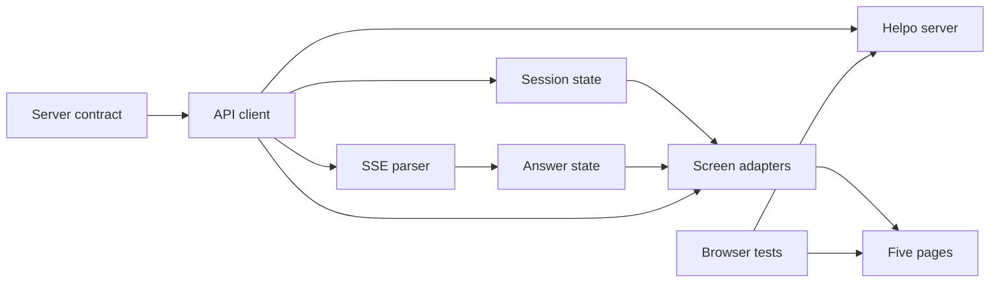
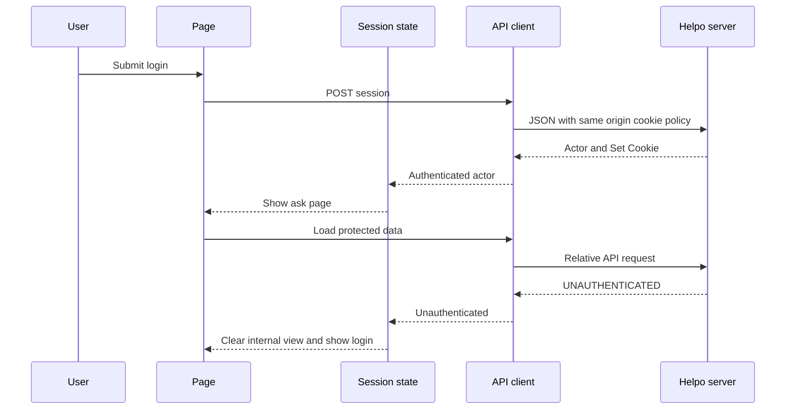
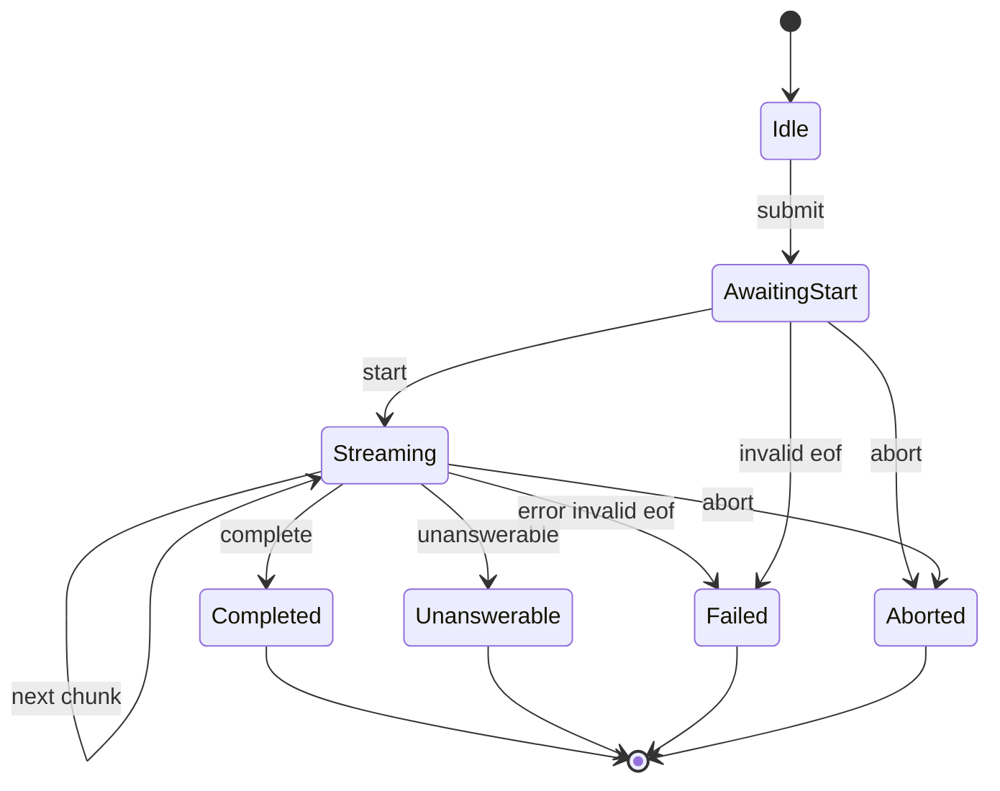
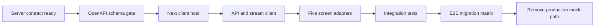

# Design Document

## Overview

`helpo-client-integration`は、既存React 5画面を先行`helpo-server`のNext.js App Router hostへ移し、browser memory mockを同一originの実HTTP APIへ置き換える。一般社員と管理者社員は従来の画面、入力境界、navigationを維持しながら、HttpOnly Cookie session、永続FAQ・履歴・評価、POST Fetch response streamを利用する。

通信のauthorityは上流仕様だけに置く。クライアントはstatus/codeをUI結果へ変換し、SSE framingと順序を検証するが、認証・認可、所有者、重複、根拠、保存の業務判定を行わない。確定データは常にAPI再取得結果で同期する。

### Goals
- 既存5画面を上流のJSON/Cookie/SSE契約へ型安全に接続する。
- 完了、回答不能、失敗、中断、session切れを曖昧なくUI stateへ変換する。
- 旧タスク6・7の画面横断条件を外部AIなしのintegration/Playwright E2Eで継承する。

### Non-Goals
- server route、schema、業務規則、永続化、AI adapter、Cookie発行、Origin/authorization判定の変更。
- tokenのJavaScript取得、client-side credential/model設定、optimisticな履歴確定。
- 本番配備、監視、FAQ削除、分析、mobile最適化。

## Boundary Commitments

### This Spec Owns
- 5画面のNext.js client host接続と既存表示・入力動作の維持。
- 上流OpenAPI由来のAPI client、token-free session UI state、error-to-UI mapping。
- POST Fetch responseのSSE parser、answer state machine、AbortController lifecycle。
- 実HTTPを通るclient integration testと一般社員・管理者社員のPlaywright E2E。

### Out of Boundary
- `/api/v1`のpath、method、request/response schema、status/error code、Cookie属性、SSE event、保存条件の定義・変更。
- auth/admin/owner、FAQ完全一致、feedback一回、grounding、same-originの最終判定。
- `OPENAI_API_KEY`、`OPENAI_MODEL`、provider SDKおよびserver-only環境設定。
- server実装とserver test、database migration/seed、ViteからNextへのserver基盤移行。

### Allowed Dependencies
- 完了済み`helpo-server`実装とそのmachine-readable OpenAPI 3.1 artifact。
- Next.js 16.3.3 / React 19.1.1 / TypeScript 5.9.2 strict、browser Fetch/ReadableStream/TextDecoder/AbortController。
- Zod 4.4.3（runtime境界parse）、Vitest 4.1.6、Testing Library、Playwright（上流とversion固定を共有）。
- 依存方向は`Contract Types → Transport → Session/Stream State → Screen Adapters → Pages`。右から左へのimportだけを許可し、clientからserver application/domain/infrastructureをimportしない。

### Revalidation Triggers
- 上流endpoint、success/error schema、status/code、Cookie名・属性、SSE frame/event/order変更。
- complete/unanswerable/error/disconnectのcommit・履歴保存条件変更。
- Next/React/TypeScript/Playwright major、browser support、same-origin hosting model変更。
- 5画面、0/1/400/401、0/1/1000/1001、role別導線、旧6/7受入条件変更。

## File Ownership Contract

| Owner | Owns | May touch only for integration | Forbidden |
|---|---|---|---|
| `helpo-server` | Next runtime/API host/common package基盤、`src/app/api/**`、domain/application/infrastructure/shared、Prisma、server tests、`.kiro/specs/helpo-server/openapi.yaml` | client pageを載せるlayout/wiringのみ | client画面/API client/E2Eの実装 |
| `helpo-client-integration` | page route（`/`, `/ask`, `/history`, `/faqs`, `/admin/faqs`系）、`src/components/**`、`src/presentation/**` API client/parser/state、client tests/E2E | hostのlayout/wiring、かつ設計承認済みclient依存に限る`package.json`/lockfile | server route/schema、OpenAPI、Prisma、domain/application/infrastructure、server dependencyの変更 |

client dependency/lockfile変更は承認済みのTesting Library/Playwright等client依存だけをversion gate後に許可する。APIはHTTP resource境界のため`/api/v1/faqs`を維持し、UIだけstructure規約どおり`/admin/faqs`系にする。

## Architecture

### Existing Architecture Analysis

現行はVite entry `src/main.tsx`、`MockApp.tsx`、5 page components、browser-only `src/shared/mock/*`で構成される。上流server task 1.2がNext.js hostとNode Runtimeを先に提供する。本仕様はそのhost上で既存page markup/validationを再利用し、production pathからmock store、manual clock、controlled answer、screen access authorityを除去する。既存mock unit testsは純粋な表示・入力回帰として残せるものだけをNext環境へ移す。

### Architecture Pattern & Boundary Map



- **Selected pattern**: contract-first typed transport + reducer-based UI state。
- **Authority rule**: API clientはtransport結果を返し、screen adapterが表示へ変換する。server拒否をclient validationで成功へ変えない。
- **State rule**: session tokenはstateに存在しない。回答の部分textはephemeral、履歴/FAQ/feedbackは再取得値がauthoritative。
- **Dependency rule**: pageはfetchを直接呼ばず、adapter経由とする。API clientはReactへ依存しない。

### Technology Stack

| Layer | Choice / Version | Role in Feature | Notes |
|---|---|---|---|
| Frontend | Next.js 16.3.3候補, React 19.1.1既存lockfile固定済み | App Router host、client components | 2026-08-28。Nextは上流公式検証・lockfile固定後だけ採用 |
| Language/validation | TypeScript 5.9.2候補 strict, Zod 4.4.3候補 | generated type、runtime response/event parse | 2026-08-28候補。公式release/互換確認後固定。`any`、unchecked cast禁止 |
| Browser platform | Fetch, ReadableStream, TextDecoder, AbortController | same-origin JSON/SSE、中断 | Web標準。EventSourceはPOST不可のため不使用 |
| Tests | Vitest 4.1.6候補, Testing Library/Playwright version未固定 | parser/state/integration/E2E | 2026-08-28候補。公式Node/browser互換を実装開始gateで確認しlockfile固定。external AIを呼ばない |

## File Structure Plan

```text
src/app/layout.tsx                         # Next document shellとglobal style
src/app/page.tsx                           # login entry
src/app/ask/page.tsx                       # 質問route shell
src/app/history/page.tsx                   # 履歴route shell
src/app/faqs/page.tsx                      # FAQ閲覧route shell
src/app/admin/faqs/page.tsx                # FAQ管理一覧/新規route shell
src/app/admin/faqs/[faqId]/page.tsx        # FAQ編集route shell（structure規約のadmin境界）
src/components/client/helpo-client.tsx     # 5画面、navigation、provider統合
src/components/authenticated-navigation.tsx # 既存navigationをNext navigationへ接続
src/pages/LoginPage.tsx                    # login adapter propsへ移行
src/pages/AskPage.tsx                      # answer state/feedback propsへ移行
src/pages/history-page.tsx                 # server history propsへ移行
src/pages/faq-page.tsx                     # server FAQ/role propsへ移行
src/pages/faq-admin-page.tsx               # create/update結果propsへ移行
src/presentation/api/contract.ts           # OpenAPI由来public DTO再export
src/presentation/api/api-client.ts         # JSON endpoint transportとruntime parse
src/presentation/api/api-error.ts          # status/code判別unionとsafe fallback
src/presentation/stream/sse-parser.ts      # incremental UTF-8 SSE framing
src/presentation/stream/answer-state.ts    # event順序とUI reducer
src/presentation/session/session-state.tsx # token-free actor/session provider
src/presentation/screens/use-ask-screen.ts # 質問/abort/retry/feedback adapter
src/presentation/screens/use-history-screen.ts # history load adapter
src/presentation/screens/use-faq-screen.ts # FAQ list/create/update adapter
tests/unit/client/                         # API error、parser、reducer、screen adapter
tests/integration/client/                  # 実Route Handlerを通るUI/API tests
tests/e2e/employee.spec.ts                 # 一般社員主要導線
tests/e2e/admin.spec.ts                    # 管理者FAQ導線
tests/e2e/session-errors.spec.ts           # 401/403/423/5xx/stream failure
tests/e2e/persistence.spec.ts              # terminal別再取得と再起動相当
tests/e2e/security.spec.ts                 # artifact/log/bundle秘密非露出
playwright.config.ts                       # local server、artifact安全既定値
```

### Modified or Removed from Production Path
- `src/main.tsx` — Vite entryとしては廃止し、Next route entryへ置換。
- `src/MockApp.tsx` — mock ownershipを除去し、`helpo-client`へ表示統合だけを移管。
- `src/shared/mock/{mock-store,controlled-answer,manual-clock,screen-access}.ts` — production importを全廃。必要な決定性は上流server fixtureから得る。
- `src/shared/validation/graphemes.ts` — 既存client入力UXで継続利用するが、server validation authorityを置換しない。

## System Flows

### Session and protected navigation



### Answer stream and persistence observation

```mermaid
sequenceDiagram
    participant U as User
    participant Q as Ask adapter
    participant A as API client
    participant H as Helpo server
    participant P as SSE parser
    participant R as Answer reducer
    U->>Q: Submit question
    Q->>A: POST answers with abort signal
    A->>H: Accept event stream
    H-->>P: Fragmented UTF8 bytes
    P-->>R: start then chunks
    alt committed complete
        P-->>R: complete
        R-->>Q: Final answer sources feedback enabled
    else committed unanswerable
        P-->>R: unanswerable
        R-->>Q: Guidance shown; feedback unavailable
    else failure
        P-->>R: error or invalid end
        R-->>Q: Failed retry state
    else user abort
        Q--xH: Abort request
        Q-->>R: Aborted no local history
    end
```

`complete`/`unanswerable`はserver commit後にだけ届く。clientはterminal受信前に履歴へ追加せず、履歴画面でGET `/history`を再実行する。commit後のtransport切断ではserver履歴が残り得るため、再取得結果を優先する。

## Requirements Traceability

| Requirement | Summary | Components | Interfaces | Flows |
|---|---|---|---|---|
| 1.1, 1.2, 1.3, 1.4, 1.5 | 5画面と実データ | HelpoClient, ScreenAdapters, Pages | Screen state | Session |
| 2.1, 2.2, 2.3, 2.4, 2.5, 2.6, 2.7, 2.8 | session/access | SessionState, ApiClient, ErrorMapper | Session/Error | Session |
| 3.1, 3.2, 3.3, 3.4, 3.5, 3.6, 3.7, 3.8, 3.9 | HTTP error/input | ApiClient, ErrorMapper, ScreenAdapters | ApiResult | Both |
| 4.1, 4.2, 4.3, 4.4, 4.5, 4.6, 4.7, 4.8, 4.9, 4.10, 4.11 | stream lifecycle | ApiClient, SseParser, AnswerState, AskAdapter | AnswerEvent/State | Answer |
| 5.1, 5.2, 5.3, 5.4, 5.5, 5.6 | owner history/save display | HistoryAdapter, HistoryPage | History DTO | Answer |
| 6.1, 6.2, 6.3, 6.4, 6.5, 6.6, 6.7, 6.8 | FAQ | FaqAdapter, FaqPages | FAQ DTO | Session |
| 7.1, 7.2, 7.3, 7.4 | feedback | AskAdapter, ApiClient | Feedback DTO | Answer |
| 8.1, 8.2, 8.3, 8.4, 8.5 | browser security | all client boundaries, SecurityTests | relative fetch/token-free state | Both |
| 9.1, 9.2, 9.3, 9.4, 9.5, 9.6, 9.7, 9.8 | deterministic migration tests | ClientIntegration, Playwright suites | fixture/test contracts | Both |

## Components and Interfaces

| Component | Domain/Layer | Intent | Req Coverage | Key Dependencies | Contracts |
|---|---|---|---|---|---|
| ContractTypes | boundary | 上流OpenAPI型とruntime schema | 1–9 | server artifact P0 | API, Event |
| ApiClient | transport | 同一origin JSON/SSE request | 2–8 | ContractTypes P0 | Service, API |
| ErrorMapper | presentation | status/codeからUI outcome | 2, 3 | ContractTypes P0 | Service |
| SessionState | state | token-free actor lifecycle | 2, 8 | ApiClient P0 | State |
| SseParser | protocol | byteからvalidated event | 4, 9 | Streams P0 | Service, Event |
| AnswerState | state | event orderとterminal UI state | 4, 5, 7 | SseParser P0 | State |
| ScreenAdapters | presentation | API stateを5画面propsへ変換 | 1–7 | client/state P0 | Service, State |
| FivePages | UI | 既存表示・入力・navigation維持 | 1–7 | adapters P0 | State |
| ClientIntegrationTests | test | 実route/response境界検証 | 3–9 | server fixtures P0 | API, Event |
| PlaywrightSuites | test | role別画面横断受入 | 1–9 | local server P0 | Batch |

### Boundary Contracts

```typescript
type HttpErrorCode =
  | 'VALIDATION_ERROR' | 'INVALID_CREDENTIALS' | 'UNAUTHENTICATED'
  | 'FORBIDDEN' | 'ORIGIN_FORBIDDEN' | 'NOT_FOUND'
  | 'FAQ_QUESTION_CONFLICT' | 'FEEDBACK_CONFLICT' | 'LOGIN_LOCKED'
  | 'UNSUPPORTED_MEDIA_TYPE' | 'NOT_ACCEPTABLE' | 'INTERNAL_ERROR'

type SseError =
  | { code: 'AI_UNAVAILABLE'; retryable: true }
  | { code: 'AI_TIMEOUT'; retryable: true }
  | { code: 'GROUNDING_FAILED'; retryable: false }
  | { code: 'PERSISTENCE_FAILED'; retryable: true }
  | { code: 'INTERNAL_ERROR'; retryable: false }

type ErrorCore<C extends HttpErrorCode> = Readonly<{
  ok: false
  requestId: string
  code: C
  message: string
}>
type UnknownResponse = Readonly<{ ok: false; status: number; code: 'UNKNOWN_RESPONSE'; message: string }>
type OperationId = keyof GeneratedOperationFailures
type OperationFailure<Id extends OperationId> = GeneratedOperationFailures[Id] | UnknownResponse
type ApiResult<Id extends OperationId, T> = Readonly<{ ok: true; value: T }> | OperationFailure<Id>

type AnswerEvent =
  | Readonly<{ type: 'start'; answerId: string }>
  | Readonly<{ type: 'chunk'; answerId: string; sequence: number; text: string }>
  | Readonly<{ type: 'complete'; answerId: string; answer: string; sources: readonly SourceDto[] }>
  | Readonly<{ type: 'unanswerable'; answerId: string; reason: string; message: string }>
  | Readonly<{ type: 'error'; answerId: string; message: string } & SseError>

interface HelpoApiClient {
  login(input: Readonly<{ employeeId: string; password: string }>): Promise<ApiResult<'login', ActorDto>>
  getSession(): Promise<ApiResult<'getSession', ActorDto>>
  logout(): Promise<ApiResult<'logout', void>>
  listFaqs(): Promise<ApiResult<'listFaqs', readonly FaqDto[]>>
  createFaq(input: Readonly<{ question: string; answer: string }>): Promise<ApiResult<'createFaq', FaqDto>>
  updateFaq(faqId: string, input: Readonly<{ question: string; answer: string }>): Promise<ApiResult<'updateFaq', FaqDto>>
  streamAnswer(question: string, signal: AbortSignal): Promise<ApiResult<'streamAnswer', AsyncIterable<AnswerEvent>>>
  listHistory(): Promise<ApiResult<'listOwnHistory', readonly HistoryDto[]>>
  submitFeedback(answerId: string, value: 'GOOD' | 'BAD'): Promise<ApiResult<'submitFeedback', FeedbackDto>>
}
```

`GeneratedOperationFailures`は上流machine-readable OpenAPI artifactの各operationに宣言されたstatus/code組だけから生成する。各methodの戻り値はoperation-specificであり、そのoperationに定義されないcodeを返せない型にする。契約外status/codeまたはmalformed responseだけは`UNKNOWN_RESPONSE`へ閉じ、全operationのerror unionを共通の`ApiFailure`として公開しない。`ActorDto`, `FaqDto`, `SourceDto`, `HistoryDto`, `FeedbackDto`も同artifactから生成する。手書きでfieldを補完しない。上流designで明示済みのFAQ fieldは`id/question/answer/createdAt/updatedAt`、historyはanswer ID・askedAt・question・completeまたはunanswerable・sources・`complete`だけ任意feedback（`unanswerable.feedback`は常にnull）、feedback valueは`GOOD|BAD`である。artifactがこれらの全success schemaを展開していなければ実装を開始せず上流契約を正す。

#### API Matrix

全pathは`/api/v1`相対。Cookie名`helpo_session`はbrowser/serverだけが扱う。

| Method | Path | Request | Success | Client behavior |
|---|---|---|---|---|
| GET | `/session` | bodyなし | 200 Actor envelope | refresh/direct accessでactor/role復元、401でstate消去 |
| POST | `/session` | JSON employeeId,password | 200 Actor envelope; Set-Cookie | actor state設定 |
| DELETE | `/session` | bodyなし | 204; clear Cookie | state消去 |
| GET | `/faqs` | bodyなし | 200 `{items: Faq[]}` | list置換 |
| POST | `/faqs` | JSON question,answer | 201 Faq | list再取得 |
| PATCH | `/faqs/{faqId}` | JSON question,answer | 200 Faq | list再取得 |
| POST | `/answers` | JSON question; Accept SSE | 200 event stream | parser/reducer開始 |
| GET | `/history` | bodyなし | 200 newest-first history | list置換 |
| POST | `/answers/{answerId}/feedback` | JSON value | 201 Feedback | history/result再取得 |

JSON state changeは`Content-Type: application/json`。回答は`Accept: text/event-stream`。相対URL、`credentials: 'same-origin'`、`cache: 'no-store'`を使用する。Origin headerはbrowserが管理し、client codeが偽装しない。

### SSE Parser and Answer State



- `TextDecoder.decode(bytes, {stream:true})`でUTF-8を継続decodeし、LF空行でframeを切る。JSON内改行はescape済みとしてsingle `data:` lineをparseする。
- 最初は`start`のみ、同じanswerId、chunk.sequenceは0から連番、terminalは一回。違反、unknown event、不正JSON、terminalなしEOFは`Failed`。
- 0 chunk completeを許可する。terminal後frameは無視せずcontract failureとして記録するが、既確定UIを別terminalで上書きしない。
- Abortはtransport cancelとstate generation invalidationを行う。password/token/bodyをconsoleへ出さない。

## Error Handling

| Status/code | UI outcome |
|---|---|
| 400 `VALIDATION_ERROR` | 入力保持、`fields`を項目へ関連付け |
| 401 login `INVALID_CREDENTIALS` | 共通認証失敗 |
| 401 `UNAUTHENTICATED` | confidential view消去、login遷移 |
| 403 `FORBIDDEN` | 権限なし。admin内容非表示 |
| 403 `ORIGIN_FORBIDDEN` | 未完了案内、再読み込み |
| 404 `NOT_FOUND` | 存在を推測せず一覧再取得 |
| 409 FAQ/feedback conflict | 入力保持または既存値再取得 |
| 423 `LOGIN_LOCKED` | lock案内、loginに留まる |
| 406/415 | contract/config一般エラー |
| 5xx / stream error | safe message、`retryable`時だけ再試行 |
| unknown/malformed | fail closed `UNKNOWN_RESPONSE` |

requestIdはsupport correlation用に保持してもよいが、response body全体をlogしない。UI文言は安全なserver messageまたは既存正式文言を使い、内部例外を合成しない。

## Testing Strategy

### Unit Tests
- `SseParser`: CRLF/LF、byte/frame分割、multibyte Unicode、escaped newline、複数frame/byte、EOF flush、不正JSON/unknown event。
- `AnswerState`: start first/once、0/複数chunk、sequence gap、answerId mismatch、single terminal、terminal後data、abort。
- `ErrorMapper`: 全公開status/code、fields、unknown/malformed fail closed、401 global transition。
- Screen adapters: in-flight dedupe、stale generation破棄、再取得authority、input preservation。

### Integration Tests
- 実Route Handlerへlogin/logoutし、browser Cookie jar経由で保護APIを利用する。token値をtestへ取り出さない。
- FAQ list/create/update、400/403/404/409、history/feedback 201/409を実response schemaで検証する。
- POST answerのpreflight 400/401/403/406/415と、fragmented complete/unanswerable/error/disconnectを実ReadableStreamで検証する。
- complete/unanswerable後だけGET historyへ現れ、error/save failure/commit前abortは現れない。commit後切断は再取得結果を正とする。

### Playwright E2E
- 一般社員: login→質問→逐次回答→source→Good/Bad→history→FAQ→logout。
- 管理者: login→FAQ登録→未変更修正→完全一致競合→一覧再取得→新FAQを使う質問。
- session/error: invalid/locked login、期限切れ401、一般社員admin 403、AI timeout/retry、利用者中断。
- input/accessibility: 0/1/400/401と0/1/1000/1001 Unicode書記素、tooltip association、current navigation、empty lists。
- persistence: complete/unanswerableとfailure/disconnect matrix。外部AIを呼ばず上流fake provider/clock/test DBを使用する。

### Security Regression
- browser bundle/HTML/network JSONにAI key/model/server-only envがないことをscanする。
- JavaScriptからCookie値を参照せず、storageStateを保存しない。trace/video/screenshotは原則off、failure artifactに資格情報・token・質問・回答・FAQ本文がないことを確認する。
- console/request loggingにpassword、token、本文を出さず、第三者origin requestがないことを検証する。

## Security Considerations

- `helpo_session`は上流が`HttpOnly; SameSite=Lax; Path=/; Max-Age=86400`（HTTPS時`Secure`）で発行する。clientは名前をrequest body/headerへ複製しない。
- role表示はUXだけであり、admin/owner authorizationはserver-owned。403/404を成功扱いしない。
- `NEXT_PUBLIC_`を含むclient envへOpenAI credential/modelを置かない。clientはmodel fieldを送信しない。
- same-originはserverが検証する。clientは相対URLだけを使用し、Originを手動構築しない。

## 旧タスク6・7受入条件移管matrix

親版`b3ba6bf^:.kiro/specs/helpo/tasks.md`を根拠とする不変IDであり、旧6/7は実行対象に戻さない。

| ID | 旧条件 | new requirement | task | test / out-of-scope reason |
|---|---|---|---|---|
| LEGACY-6.1 | logout・期限切れで全画面を未認証化 | 2.4–2.7 | 2.3,4.5,5.1 | session/navigation integration + E2E |
| LEGACY-6.2 | complete/unanswerable履歴、評価反映、社員分離 | 5.1–5.6,7.1–7.4 | 4.2,4.4,5.2,6.1 | persistence/employee E2E。元条件に従い評価はcompleteのみ、unanswerable評価はout-of-scope |
| LEGACY-6.3 | FAQ変更を一覧・後続回答へ反映、role導線 | 6.1–6.8,9.5 | 4.3,6.2 | admin E2E |
| LEGACY-7.1 | login/lock/session全境界 | 2,9.2 | 2.3,5.1,6.1 | server fake Clockを通すbrowser integration |
| LEGACY-7.2 | 入力/stream/source/評価/履歴 | 3–5,7,9.1,9.3–9.4,9.6 | 3,4.1–4.4,5.2,6.1 | parser/persistence + employee E2E |
| LEGACY-7.3 | FAQ閲覧/管理/権限 | 6,9.3,9.5 | 4.3,6.2 | admin E2E |
| LEGACY-7.4 | typecheck/test/buildと禁止境界 | 1.4,8,9.7–9.8 | 6.3,6.4 | final client gate。server/API不存在確認は実API移管によりout-of-scope |

## Migration Strategy



1. 上流task 7.4完了と全success schemaを含むOpenAPI artifactをgateにする。
2. Vite-specific entryをNext route shellへ移し、既存画面をstatic propsで回帰確認する。
3. API/session/parser/stateを接続し、画面単位でmock data sourceを置換する。
4. 旧6/7 matrixが通った後だけproduction mock importsを除去する。rollbackはscreen adapter接続単位で行い、server contract/databaseを変更しない。
