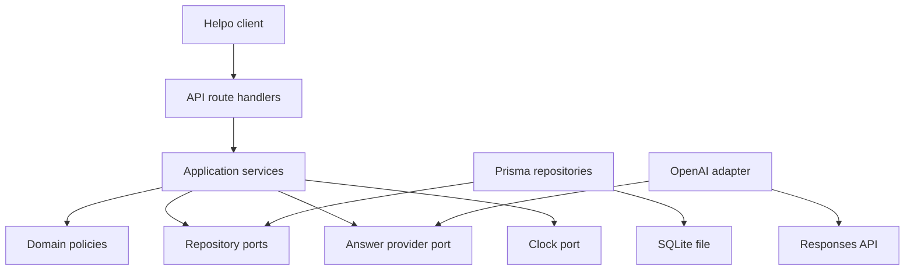
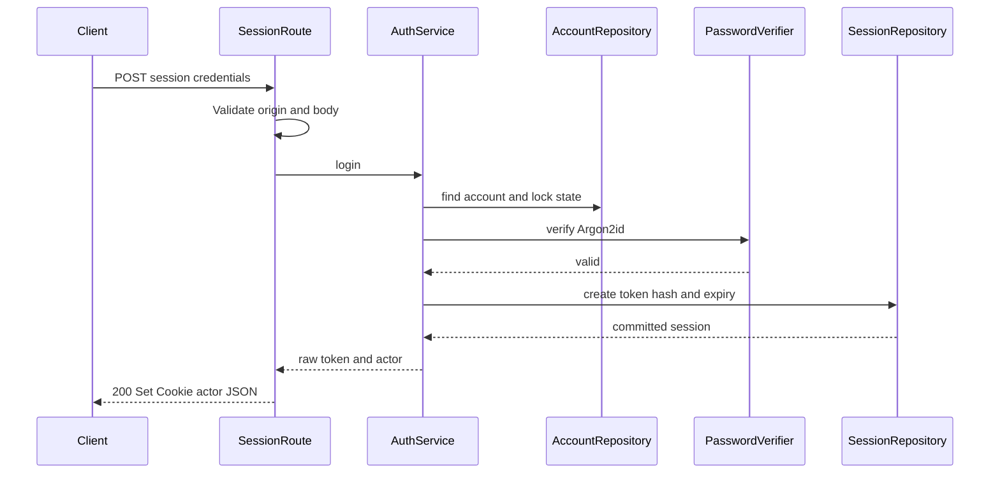
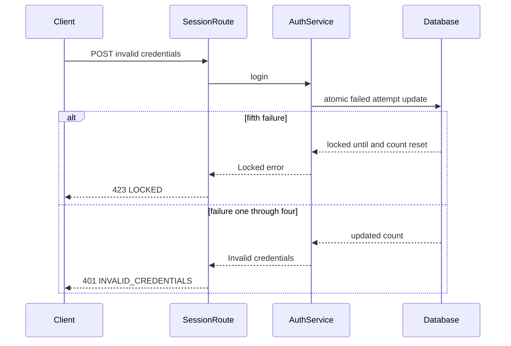
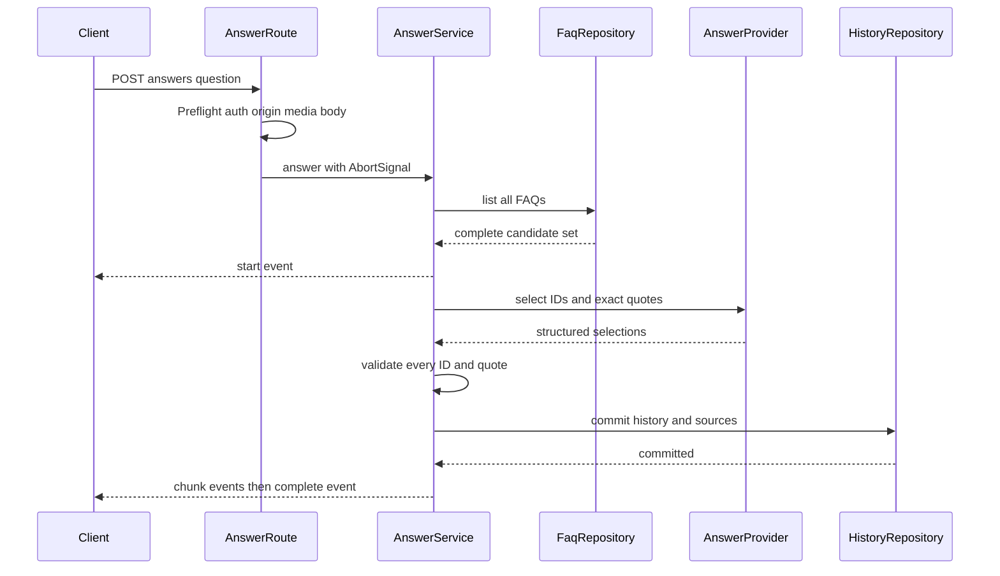
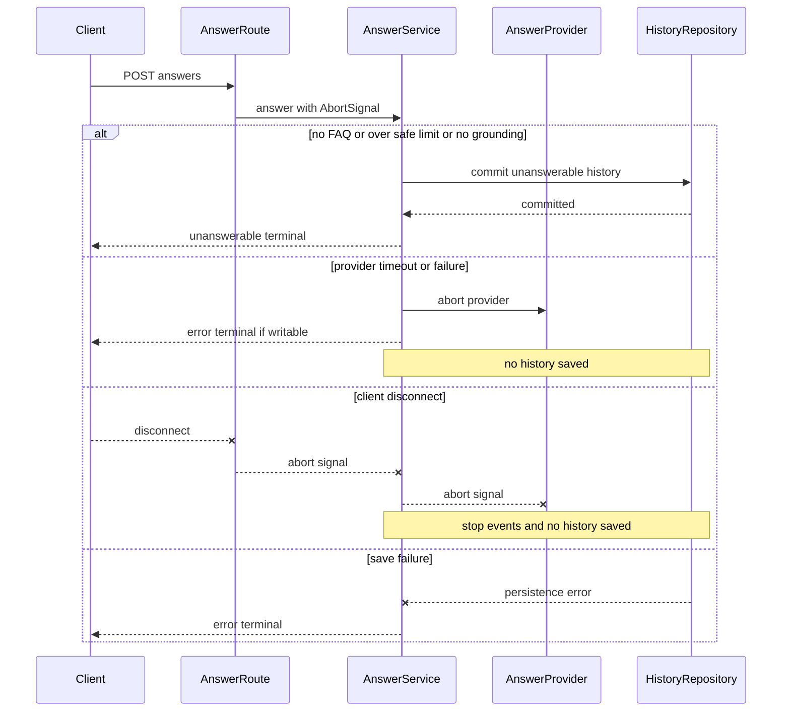
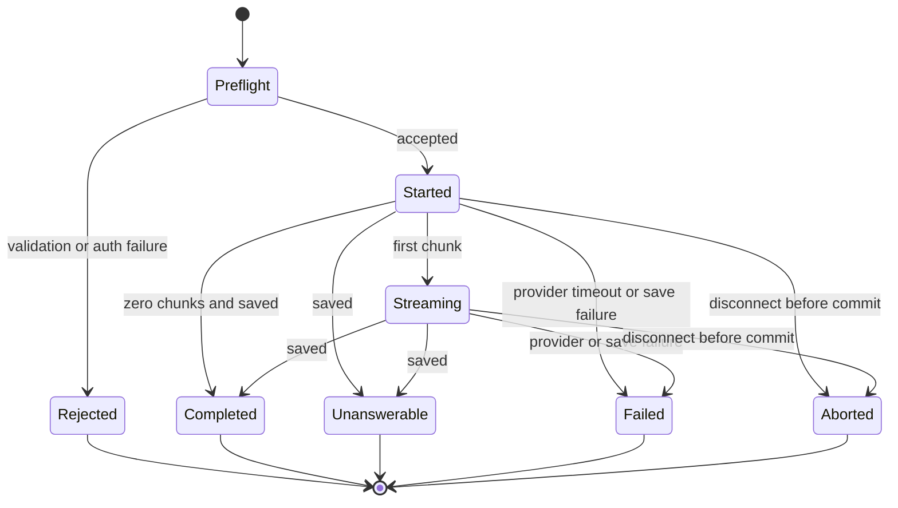
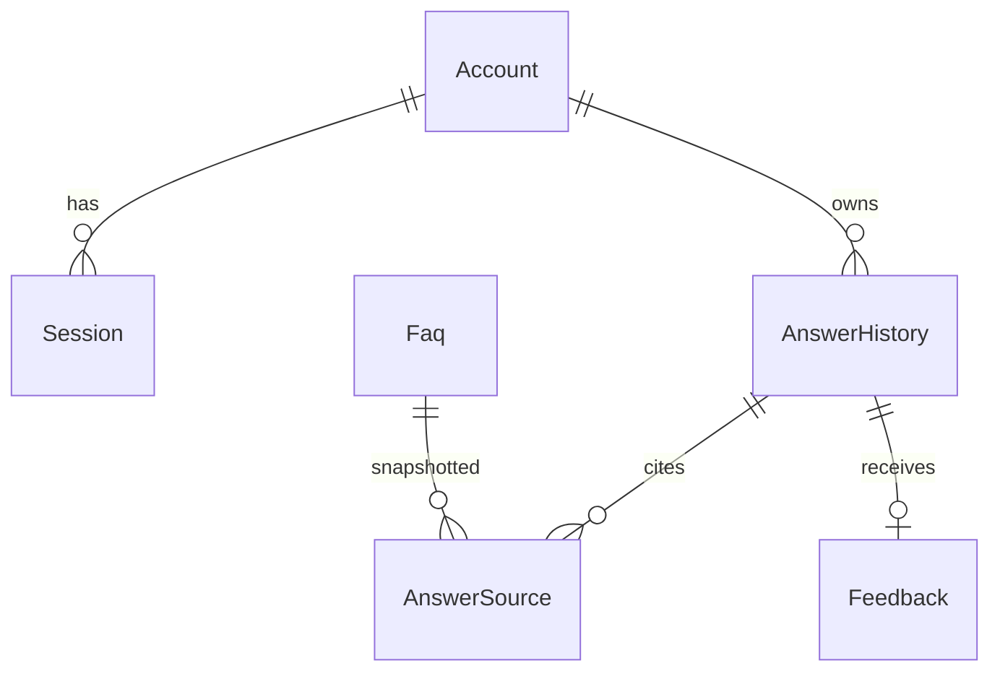
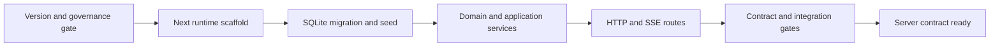

# Design Document

## Overview

Helpoサーバーは、既存ブラウザ内モックの業務状態をNext.js App RouterのNode Runtimeへ移し、一般社員・管理者社員へ認証済みHTTP APIを提供する。モジュラーモノリス内で`presentation → application → domain`を維持し、Prisma/SQLite、Argon2id、OpenAI Responses API、時刻を交換可能な外部境界として扱う。

本設計は後続`helpo-client-integration`が依存するJSON、Cookie、エラー、SSEを契約先行で固定する。通信契約の唯一の権威および実装・型生成の唯一の入力は同ディレクトリの[`openapi.yaml`](./openapi.yaml)であり、本設計内の説明や過去の抜粋を契約定義として実装してはならない。AIはFAQを回答候補から暗黙に除外せず、モデルに自由回答を許さない。serverがFAQ IDと完全一致引用を検証し、固定テンプレートからだけ回答を構成する。

### Goals
- 認証、認可、FAQ、履歴、評価を永続化し、ローカル単一instanceで一貫して提供する。
- 正常・異常・timeout・disconnectを含むHTTP/SSE契約を固定する。
- 外部AIを呼ばない決定的なunit/integration testで旧タスク7のサーバー受入条件を継承する。

### Non-Goals
- 既存5画面のAPI接続、画面状態、browser E2E（`helpo-client-integration`へ移管）。
- 本番配備、複数instance、監視基盤、backup、CI/CD、user管理、password reset。
- FAQ削除、分析、vector検索、FAQ versioning、自由生成回答。

## Boundary Commitments

### This Spec Owns
- Account（`failedCount`/`lockedUntil`を含むlock state）、Session、Faq、AnswerHistory、AnswerSource、Feedbackの業務規則と永続データ。LoginAttempt独立entityは設けない。
- `/api/v1`配下のHTTP、session Cookie、標準error、質問SSE契約。
- Argon2id password verification、opaque session、same-origin検証、owner/admin認可。
- OpenAI adapter、grounding検証、固定template、timeout/abort/save条件。
- unit/integration/contract testとmigration/seed/startup validation。

### Out of Boundary
- APIを利用する画面、navigation、逐次描画、session切れ遷移、error文言表示。
- browser E2Eと旧タスク6の画面横断統合。
- production運用、水平scale、SQLite以外、FAQ削除、分析、未承認AI利用。

### Allowed Dependencies
- Next.js App RouterのNode Runtime、React/TypeScript strict、Web Request/Response/ReadableStream。
- Prisma SQLite adapter、`argon2`、OpenAI Node SDK、Zod、Node crypto、`Intl.Segmenter`。
- `presentation → application → domain`のみ。infrastructureはapplication portを実装し、domainはframework/ORM/SDKをimportしない。

### Revalidation Triggers
- endpoint、schema、status/error code、Cookie名・属性、SSE event/frame/order変更。
- session/FAQ/history/feedbackのownershipまたは保存条件変更。
- OpenAI model/API/data policy、grounding方式、FAQ上限変更。
- Node/Next/Prisma major、Edge runtime、複数instance、PostgreSQL、vector検索への変更。
- 既存画面の0/1/400/401、0/1/1000/1001、10分、24時間の契約変更。

## File Ownership Contract

| Owner | Owns | May touch only for integration | Forbidden |
|---|---|---|---|
| `helpo-server` | `package.json`/lockfile、Next runtime/config、`src/app/api/**`、`src/domain/**`、`src/application/**`、`src/infrastructure/**`、`src/shared/**`の共通基盤、Prisma、server unit/integration/contract tests、`openapi.yaml` | clientが所有するpage/componentはhost移行に不可欠なwiring fileだけ（表示/API接続変更なし） | client画面状態・API接続・browser E2E |
| `helpo-client-integration` | `src/app`のpage route（`/`, `/ask`, `/history`, `/faqs`, `/admin/faqs`系）、`src/components/**`、`src/presentation/**` API client/parser/state、client tests/E2E | server提供hostのlayout/wiringと承認済みclient依存の`package.json`/lockfileだけ | `src/app/api/**`、server schema/domain/application/infrastructure、Prisma、server route/schema変更 |

serverがNext runtime/API host/common package基盤を先に確定する。clientのdependency/lockfile変更は設計で承認済みのclient test/runtime依存に限定し、version検証後にserver所有者のreviewを必須とする。

## Architecture

### Existing Architecture Analysis
現在はVite + React 19.1.1の5画面とbrowser memory mockだけが存在し、server route、DB、AIはない。画面の受入条件は維持するが、基盤をNext.jsへ置換し、画面接続は後続仕様まで行わない。既存UIをserver domainへimportせず、契約だけをseamとする。

### Architecture Pattern & Boundary Map



- **Selected pattern**: Clean/Hexagonal modular monolith。交換・障害再現が必要なDB、AI、Clockだけをport化する。
- **Transaction rule**: AI待機中はtransactionを保持しない。履歴+source保存後だけsuccess terminal eventを送る。
- **Runtime rule**: 全Route Handlerは`export const runtime = 'nodejs'`。Edgeを使用しない。

### Technology Stack

| Layer | Choice / Version | Role | Validation |
|---|---|---|---|
| Framework | Next.js 16.3.3候補 / React 19.1.1既存lockfile固定済み | App Router、Route Handler | 2026-08-28時点。Next候補は公式release/security/peer要件を実装開始時に再確認してからlockfile固定 |
| Language | TypeScript 5.9.2候補 strict | 全境界の型安全 | 2026-08-28候補。公式npm/releaseとNext互換を確認後にlockfile固定。`any`禁止 |
| Runtime | Node.js 24.x候補 | crypto、SDK/native addon | 2026-08-28時点候補。公式LTS表と最新security patchを実装開始時に検証しlockfile/toolchain固定 |
| Validation | Zod 4.4.3候補 | HTTP/env/AI output | 2026-08-28時点候補。公式npm情報と互換を確認後固定 |
| ORM | Prisma CLI/Client/adapter 7.10.0候補 | SQLite schema/repository | 2026-08-28時点候補。3 packageの公式同時release/互換を確認後同versionで固定。8 RC禁止 |
| Password | argon2 0.45.1候補 | Argon2id verify/hash | 2026-08-28時点候補。公式npm/native ABIを確認後固定、OWASP最低parameter以上 |
| AI | openai 7.8.0候補 Responses API | structured selection/stream | 2026-08-28時点候補。公式SDK/API/model対応と組織承認gate後に固定 |
| Test | Vitest 4.1.6候補 | unit/integration/contract | 2026-08-28時点候補。公式release/Node互換確認後固定。fake Clock/AI、temporary SQLite |

**未確定を許さない実装ゲート**: Node 24のpatch、`OPENAI_MODEL`、organization data controlsは環境・時点依存である。実装開始時に公式情報、Models API利用可否、Responses/Structured Outputs対応、保存・学習・region・組織承認を記録し、許可listへ固定する。未通過ならAI readinessをfailし、暗黙defaultを使わない。

## File Structure Plan

```text
package.json                         # Vite scripts/dependenciesをNext server/test基盤へ移行
next.config.ts                       # Next設定。秘密を公開しない
prisma.config.ts                     # Prisma 7 datasource/migration設定
prisma/schema.prisma                 # 物理modelとunique/index
prisma/migrations/                   # SQLite migration
prisma/seed.ts                       # 事前account/FAQ seed。実passwordを含めない
src/app/api/v1/session/route.ts      # GET Actor復元、POST login、DELETE logout
src/app/api/v1/faqs/route.ts         # GET list、POST create
src/app/api/v1/faqs/[faqId]/route.ts # PATCH update
src/app/api/v1/answers/route.ts      # POST SSE answer
src/app/api/v1/history/route.ts      # GET owner history
src/app/api/v1/answers/[answerId]/feedback/route.ts # POST feedback
src/domain/auth/                     # Account/session/lock policyと型
src/domain/faq/                      # FAQ invariant、Unicode validation
src/domain/answer/                   # Grounding、terminal state、fixed template
src/domain/feedback/                 # Good/Bad、一回答一評価
src/application/auth/                # Login/logout/authenticate use cases、ports
src/application/faq/                 # List/create/update use cases、repository port
src/application/answer/              # Answer orchestration、provider/repository ports
src/application/history/             # Owner-only list use case
src/application/feedback/            # Owner-only feedback use case
src/infrastructure/db/prisma.ts       # Prisma singletonとSQLite startup pragma
src/infrastructure/db/*-repository.ts # domain別repository実装
src/infrastructure/ai/openai-answer-provider.ts # Responses API adapter
src/infrastructure/security/argon2-password.ts   # Argon2id adapter
src/shared/config/server-config.ts    # server-only env schemaとapproval gate
src/shared/http/api-error.ts          # error unionからHTTP JSONへの変換
src/shared/http/origin.ts             # exact Origin validation
src/shared/http/session-cookie.ts     # Cookie serialization/clear
src/shared/http/sse.ts                # typed SSE encodeとsingle terminal guard
src/shared/security/session-token.ts  # random tokenとSHA-256 hash
src/shared/text/graphemes.ts          # Intl.Segmenter count
src/shared/time/clock.ts              # Clock port/system implementation
src/application/logging/redacting-logger.ts # 本文を型として受け取れないlogger port/metadata
src/infrastructure/logging/redacting-logger.ts # logger portの技術実装
src/types/                            # appで必要なframework declarationのみ
tests/unit/                           # policy、grounding、grapheme、state tests
tests/integration/                    # API、SQLite、SSE、redaction tests
tests/fixtures/                       # fake Clock/AnswerProvider、test DB helper
```

既存`src`の画面component/styleはNext基盤移行に必要なhost変更だけを行い、実API接続や表示状態変更をしない。UI接続をこのfile planへ追加する場合はboundary違反とする。

## System Flows

### 正常ログインと保護API


### 異常ログイン


### 正常回答と保存


### 回答不能・障害・切断


**Race boundary**: history transactionがcommitした後のnetwork disconnectは確定結果を取り消さない。commit前にabortを観測した場合は保存しない。この境界をintegration testで固定する。

## Requirements Traceability

| Requirement | Components | Contract / Flow |
|---|---|---|
| 1.1, 1.2, 1.3, 1.4, 1.5, 1.6, 1.7 | AuthService, AccountRepository, PasswordVerifier | Session API、login sequences |
| 2.1, 2.2, 2.3, 2.4, 2.5, 2.6, 2.7, 2.8 | AuthService, SessionRepository, SessionCookie | Session API、auth guard |
| 3.1, 3.2, 3.3, 3.4, 3.5, 3.6, 3.7, 3.8, 3.9, 3.10, 3.11, 3.12 | ApiRoutes, HttpBoundary | OpenAPI、error envelope |
| 4.1, 4.2, 4.3, 4.4, 4.5, 4.6, 4.7, 4.8, 4.9, 4.10, 4.11 | FaqService, FaqRepository, GraphemePolicy | FAQ APIs |
| 5.1, 5.2, 5.3, 5.4, 5.5, 5.6, 5.7, 5.8, 5.9, 5.10, 5.11 | AnswerService, GroundingPolicy, AnswerProvider | answer flow |
| 6.1, 6.2, 6.3, 6.4, 6.5, 6.6, 6.7, 6.8, 6.9, 6.10 | AnswerRoute, SseEncoder | SSE contract、all answer flows |
| 7.1, 7.2, 7.3, 7.4, 7.5, 7.6, 7.7 | AnswerService, HistoryService, HistoryRepository | history API、save boundary |
| 8.1, 8.2, 8.3, 8.4, 8.5, 8.6 | FeedbackService, FeedbackRepository | feedback API |
| 9.1, 9.2, 9.3, 9.4, 9.5, 9.6 | PrismaRepositories, SQLite | schema、transactions、restart tests |
| 10.1, 10.2, 10.3, 10.4, 10.5, 10.6 | ServerConfig, RedactingLogger, HttpBoundary | startup/error/log tests |
| 11.1, 11.2, 11.3, 11.4, 11.5, 11.6 | AnswerService, AnswerProvider, SseEncoder | abnormal answer flow |
| 12.1, 12.2, 12.3, 12.4, 12.5, 12.6, 12.7 | FakeClock, FakeAnswerProvider, TestDatabase | unit/integration/contract suites |

## Components and Interfaces

| Component | Layer | Intent | Req Coverage | Dependencies | Contracts |
|---|---|---|---|---|---|
| HttpBoundary | presentation/shared | auth、origin、validation、error変換 | 2, 3, 10 | Zod P0 | API |
| AuthService | application | login/lock/session lifecycle | 1, 2 | auth repos、Clock P0 | Service, State |
| FaqService | application | list/create/update/admin auth | 4, 9 | FaqRepository P0 | Service |
| AnswerService | application | AI orchestration、abort、save terminal | 5, 6, 7, 11 | provider/repos P0 | Service, Event |
| HistoryService | application | owner-only history | 7 | HistoryRepository P0 | Service |
| FeedbackService | application | owner-only one-time feedback | 8 | FeedbackRepository P0 | Service |
| GroundingPolicy | domain | exact quote validation/fixed template | 5 | none | Service |
| PrismaRepositories | infrastructure | atomic persistence | 1, 2, 4, 7, 8, 9 | Prisma/SQLite P0 | State |
| OpenAiAnswerProvider | infrastructure | Structured Outputs selections | 5, 11 | OpenAI P0 | Service, Event |
| SecurityAdapters | infrastructure/shared | Argon2id/token/cookie/origin | 1, 2, 3, 10 | argon2/crypto P0 | Service |
| ServerConfig | shared | env/model/governance readiness | 5, 10, 11 | Zod P0 | State |
| TestDoubles | tests | deterministic clock/AI/DB | 12 | Vitest P0 | Service, State |

### Application Service Contracts

```typescript
type AppError =
  | { kind: 'validation'; code: string; fields?: Readonly<Record<string, readonly string[]>> }
  | { kind: 'unauthenticated'; code: string }
  | { kind: 'forbidden'; code: string }
  | { kind: 'not_found'; code: string }
  | { kind: 'conflict'; code: string }
  | { kind: 'locked'; code: 'LOGIN_LOCKED'; retryAt: Date }
  | { kind: 'dependency'; code: string; retryable: boolean }
  | { kind: 'internal'; code: string; requestId: string }

type Result<T> = { ok: true; value: T } | { ok: false; error: AppError }

interface AuthService {
  login(input: LoginInput): Promise<Result<LoginResult>>
  authenticate(token: string): Promise<Result<Actor>>
  logout(actor: Actor, token: string): Promise<Result<void>>
}
interface FaqService {
  list(actor: Actor): Promise<Result<readonly FaqDto[]>>
  create(actor: Actor, input: FaqInput): Promise<Result<FaqDto>>
  update(actor: Actor, faqId: string, input: FaqInput): Promise<Result<FaqDto>>
}
interface AnswerService {
  stream(actor: Actor, input: QuestionInput, signal: AbortSignal): AsyncIterable<AnswerEvent>
}
interface HistoryService {
  list(actor: Actor): Promise<Result<readonly HistoryDto[]>>
}
interface FeedbackService {
  submit(actor: Actor, answerId: string, value: 'GOOD' | 'BAD'): Promise<Result<FeedbackDto>>
}
```

**Invariants**: actorはsessionからのみ生成する。login以外はvalid actor必須。外部境界値はZod parse後にdomainへ渡す。`any`とunchecked castを使わない。

### Grounding and Provider Contracts

```typescript
type GroundingSelection = Readonly<{ faqId: string; quote: string }>
type ProviderResult =
  | { kind: 'selected'; selections: readonly GroundingSelection[] }
  | { kind: 'unanswerable'; reason: 'NO_GROUNDING' }

interface AnswerProvider {
  select(input: Readonly<{
    question: string
    candidates: readonly Readonly<{ id: string; answer: string }>[]
  }>, signal: AbortSignal): Promise<ProviderResult>
}

type AnswerEvent =
  | { type: 'start'; answerId: string }
  | { type: 'chunk'; answerId: string; sequence: number; text: string }
  | { type: 'complete'; answerId: string; answer: string; sources: readonly SourceDto[] }
  | { type: 'unanswerable'; answerId: string; reason: string; message: string }
  | { type: 'error'; answerId: string; code: 'AI_UNAVAILABLE'; message: string; retryable: true }
  | { type: 'error'; answerId: string; code: 'AI_TIMEOUT'; message: string; retryable: true }
  | { type: 'error'; answerId: string; code: 'GROUNDING_FAILED'; message: string; retryable: false }
  | { type: 'error'; answerId: string; code: 'PERSISTENCE_FAILED'; message: string; retryable: true }
  | { type: 'error'; answerId: string; code: 'INTERNAL_ERROR'; message: string; retryable: false }
```

OpenAIには`store:false`、stream、strict JSON schemaを指定する。provider deltaはadapter内で集約・検証し、公開chunkはserver固定templateの安全な文字列だけから生成する。`OPENAI_MODEL`はallowlist一致と実装ゲート通過が必須。

## API Contract

Base pathは`/api/v1`。request/responseはUTF-8。JSON endpointは`application/json`、answer成功は`text/event-stream; charset=utf-8`、`Cache-Control: no-store`、`X-Accel-Buffering: no`。Cookie名は`helpo_session`。

| Method | Endpoint | Success | Authorization | Errors |
|---|---|---|---|---|
| GET | `/session` | 200 Actor envelope | session | 401, 500 |
| POST | `/session` | 200 Actor envelope + Set-Cookie | anonymous | 400, 401, 403, 423, 415, 500 |
| DELETE | `/session` | 204 + clear Cookie | session | 401, 403, 500 |
| GET | `/faqs` | 200 FaqList | session | 401, 500 |
| POST | `/faqs` | 201 Faq | admin | 400, 401, 403, 409, 415, 500 |
| PATCH | `/faqs/{faqId}` | 200 Faq | admin | 400, 401, 403, 404, 409, 415, 500 |
| POST | `/answers` | 200 SSE | session | preflight 400, 401, 403, 406, 415, 500; post-start error event |
| GET | `/history` | 200 HistoryList | session owner | 401, 500 |
| POST | `/answers/{answerId}/feedback` | 201 Feedback | answer owner | 400, 401, 403 origin, 404, 409, 415, 500 |

### Error Envelope
```json
{
  "error": {
    "requestId": "01J...",
    "code": "VALIDATION_ERROR",
    "message": "入力内容を確認してください",
    "fields": { "question": ["質問は400文字以内で入力してください"] }
  }
}
```
`fields`はvalidation時だけ存在する。HTTP安定code union: `VALIDATION_ERROR`, `INVALID_CREDENTIALS`, `UNAUTHENTICATED`, `FORBIDDEN`, `ORIGIN_FORBIDDEN`, `NOT_FOUND`, `FAQ_QUESTION_CONFLICT`, `FEEDBACK_CONFLICT`, `LOGIN_LOCKED`, `UNSUPPORTED_MEDIA_TYPE`, `NOT_ACCEPTABLE`, `INTERNAL_ERROR`。SSE codeは別unionとし下記Error Handlingおよび`openapi.yaml`に従う。

### SSE Frame and State
各frameは`event: <type>\ndata: <single-line JSON>\n\n`。JSON内改行はescapeする。eventは`start`, `chunk`, `complete`, `unanswerable`, `error`。state machine:



`start`は一回かつ最初。`chunk.sequence`は0から連続増加。terminalは一回。complete/unanswerableはDB commit後、errorは保存なし。client disconnect後はframeを書かない。

### OpenAPI 3.1 Artifact（権威契約）

完全な機械可読契約は同ディレクトリの[`openapi.yaml`](./openapi.yaml)であり、全route、request/success envelope、HTTP status/code、SSE discriminator union、UUID/date-time/nullability/required/additionalPropertiesの唯一の権威とする。requirements、design、tasksおよびclientはartifactを参照し、本文との不一致時はartifactを修正してから実装する。以下は設計経緯の監査だけを目的とする凍結済みの旧core抜粋であり、仕様解釈、実装、test fixture、型生成、code generationの入力として使用してはならない。

### 旧OpenAPI core抜粋（非規範・実装禁止・監査専用）

```yaml
openapi: 3.1.0
info: { title: Helpo Server API, version: 1.0.0 }
servers: [{ url: /api/v1 }]
paths:
  /session:
    post:
      operationId: login
      requestBody:
        required: true
        content:
          application/json:
            schema:
              type: object
              additionalProperties: false
              required: [employeeId, password]
              properties:
                employeeId: { type: string, minLength: 1 }
                password: { type: string, minLength: 1 }
      responses:
        '200': { description: Authenticated; session cookie is set }
        '400': { $ref: '#/components/responses/BadRequest' }
        '401': { $ref: '#/components/responses/Unauthorized' }
        '423': { $ref: '#/components/responses/Locked' }
    delete:
      operationId: logout
      responses:
        '204': { description: Session revoked and cookie cleared }
        '401': { $ref: '#/components/responses/Unauthorized' }
  /faqs:
    get:
      operationId: listFaqs
      responses:
        '200':
          description: FAQ list
          content: { application/json: { schema: { type: object, required: [items], properties: { items: { type: array, items: { $ref: '#/components/schemas/Faq' } } } } } }
    post:
      operationId: createFaq
      requestBody: { $ref: '#/components/requestBodies/FaqInput' }
      responses:
        '201': { description: Created }
        '400': { $ref: '#/components/responses/BadRequest' }
        '403': { $ref: '#/components/responses/Forbidden' }
        '409': { $ref: '#/components/responses/Conflict' }
  /faqs/{faqId}:
    patch:
      operationId: updateFaq
      parameters: [{ name: faqId, in: path, required: true, schema: { type: string, format: uuid } }]
      requestBody: { $ref: '#/components/requestBodies/FaqInput' }
      responses:
        '200': { description: Updated }
        '404': { $ref: '#/components/responses/NotFound' }
        '409': { $ref: '#/components/responses/Conflict' }
  /answers:
    post:
      operationId: streamAnswer
      requestBody:
        required: true
        content: { application/json: { schema: { type: object, additionalProperties: false, required: [question], properties: { question: { type: string, description: 1 to 400 Unicode graphemes } } } } }
      responses:
        '200': { description: SSE stream with start then one terminal event, content: { text/event-stream: { schema: { type: string } } } }
        '400': { $ref: '#/components/responses/BadRequest' }
        '401': { $ref: '#/components/responses/Unauthorized' }
        '406': { description: SSE not acceptable }
  /history:
    get:
      operationId: listOwnHistory
      responses:
        '200': { description: Newest-first owner history }
  /answers/{answerId}/feedback:
    post:
      operationId: submitFeedback
      parameters: [{ name: answerId, in: path, required: true, schema: { type: string, format: uuid } }]
      requestBody:
        required: true
        content: { application/json: { schema: { type: object, additionalProperties: false, required: [value], properties: { value: { enum: [GOOD, BAD] } } } } }
      responses:
        '201': { description: Feedback stored }
        '404': { $ref: '#/components/responses/NotFound' }
        '409': { $ref: '#/components/responses/Conflict' }
components:
  schemas:
    Faq:
      type: object
      additionalProperties: false
      required: [id, question, answer, createdAt, updatedAt]
      properties:
        id: { type: string, format: uuid }
        question: { type: string }
        answer: { type: string }
        createdAt: { type: string, format: date-time }
        updatedAt: { type: string, format: date-time }
    ApiError:
      type: object
      additionalProperties: false
      required: [error]
      properties:
        error:
          type: object
          required: [requestId, code, message]
          properties:
            requestId: { type: string }
            code: { type: string }
            message: { type: string }
            fields: { type: object, additionalProperties: { type: array, items: { type: string } } }
  requestBodies:
    FaqInput:
      required: true
      content: { application/json: { schema: { type: object, additionalProperties: false, required: [question, answer], properties: { question: { type: string, description: 1 to 1000 Unicode graphemes }, answer: { type: string, description: 1 to 1000 Unicode graphemes } } } } }
  responses:
    BadRequest: { description: Invalid input, content: { application/json: { schema: { $ref: '#/components/schemas/ApiError' } } } }
    Unauthorized: { description: Missing or expired session, content: { application/json: { schema: { $ref: '#/components/schemas/ApiError' } } } }
    Forbidden: { description: Forbidden, content: { application/json: { schema: { $ref: '#/components/schemas/ApiError' } } } }
    NotFound: { description: Not found or hidden by ownership, content: { application/json: { schema: { $ref: '#/components/schemas/ApiError' } } } }
    Conflict: { description: State conflict, content: { application/json: { schema: { $ref: '#/components/schemas/ApiError' } } } }
    Locked: { description: Login locked, content: { application/json: { schema: { $ref: '#/components/schemas/ApiError' } } } }
```

全state-changing endpointは`Origin`必須、session Cookie必須（loginを除く）、JSON Content-Type必須。GETはOrigin検証不要だがstate changeなし。旧抜粋で省略されたresponseを含む完全な定義は`openapi.yaml`だけを正とする。HTTP APIは管理者専用操作を含め業務resource境界として`/api/v1/faqs`を維持し、UI routeだけをstructure規約の管理境界`/admin/faqs`系へ置く。API認可は各操作でadmin判定するため、UI pathとAPI resource pathを一致させない。

## Data Models



| Model | Key fields | Constraints / indexes |
|---|---|---|
| Account | id UUID, employeeId, passwordHash, role, failedCount, lockedUntil | employeeId unique; role enum |
| Session | id UUID, tokenHash bytes/hex, accountId, createdAt, expiresAt, revokedAt | tokenHash unique; accountId/expiresAt index |
| Faq | id UUID, question, answer, createdAt, updatedAt | question unique exact binary comparison |
| AnswerHistory | id UUID, accountId, question, outcome, answer nullable, reason nullable, askedAt | accountId/askedAt descending index; outcome enum |
| AnswerSource | answerId, faqId required FK, faqQuestion, exactQuote, ordinal | answerId/ordinal unique; FAQ削除なしの現範囲ではfaqId必須FK; text snapshot preserves history |
| Feedback | id UUID, answerId, accountId, value, createdAt | answerId unique; accountId must equal history owner in service transaction |

SQLite text duplicate semantics must bebyte/文字列完全一致とし、case fold/trim/Unicode normalizationを暗黙に行わない。空白判定だけはvalidationでtrim相当を行い、保存値自体は入力を保持する。FAQ update/feedbackはDB unique violationを409へ変換する。Session tokenは32 random bytesをbase64url化し、DBにはSHA-256 digestだけを保存する。

## Error Handling

- **Preflight**: request ID生成 → content negotiation → Origin → Cookie/auth → JSON/Zod → application。失敗はstream開始前JSON error。
- **Post-start**: HTTP code unionとは分離したSSE code unionだけを使う。`AI_UNAVAILABLE`（retryable=true）、`AI_TIMEOUT`（true）、`GROUNDING_FAILED`（false）、`PERSISTENCE_FAILED`（true）、`INTERNAL_ERROR`（false）へ固定し、raw provider messageを返さない。HTTP unionは`VALIDATION_ERROR | INVALID_CREDENTIALS | UNAUTHENTICATED | FORBIDDEN | ORIGIN_FORBIDDEN | NOT_FOUND | FAQ_QUESTION_CONFLICT | FEEDBACK_CONFLICT | LOGIN_LOCKED | UNSUPPORTED_MEDIA_TYPE | NOT_ACCEPTABLE | INTERNAL_ERROR`であり、AI/TIMEOUTをHTTP preflight codeに混在させない。
- **Timeout**: 設定値`OPENAI_TIMEOUT_MS`を安全な範囲でZod検証し、AbortControllerでproviderへ伝播する。自動retryはしない（重複costとdisconnect遅延を避け、client明示retryとする）。
- **Logging**: requestId、route template、status/error code、duration、actorの非可逆ID（必要時）、provider分類のみ。password/token/question/answer/FAQ/provider bodyを禁止する。
- **Health**: production監視は対象外。startup config/database migration不整合はfail fast、AI governance/model readiness不成立時はAI endpointを安全に5xxへする。

## Security Considerations

- Argon2idは`memoryCost=19456 KiB`, `timeCost=2`, `parallelism=1`, `hashLength=32`以上。研修hostで約1秒未満を目標にbenchmarkし、最低値を下げない。
- 認証失敗文言はaccount存在を区別しない。lock判定・失敗count更新はtransactionで直列化する。
- Cookieは`HttpOnly; SameSite=Lax; Path=/; Max-Age=86400`、HTTPS時`Secure`。logoutで同属性、`Max-Age=0`。
- Originは設定済みcanonical originとscheme/host/portをexact比較する。欠落、`null`、複数値、不一致はstate changeを拒否する。
- AI keyは`OPENAI_API_KEY`のみ。`NEXT_PUBLIC_`禁止。Responsesは`store:false`。FAQをdata delimiters内へ置き、tool/URL/DB accessを与えない。
- model outputはstrict schemaに加えZod parseし、candidate membershipと`faq.answer.includes(quote)`をserverで再検証する。空引用、重複、不明IDは拒否する。

## Testing Strategy

### Unit Tests
- AuthService: 1〜4失敗、5回目lock/reset、10分直前/ちょうど、success reset、24時間直前/ちょうど。
- GraphemePolicy: 0/1/400/401、0/1/1000/1001、結合文字、family emoji、改行、空白のみ。
- GroundingPolicy: all candidates、unknown ID、exact/non-exact quote、prompt injection FAQ、dedupe、fixed template。
- Answer state: start first、sequence、single terminal、timeout/abort、save-before-complete。
- session token/cookie/origin/config redaction。

### Integration Tests
- temporary SQLite migration/seed/restart後のFAQ/session/lock/history/feedback persistence。
- API contract: status、content type、error code/fields、Cookie属性、GET non-mutation、Origin/415/406。
- admin FAQ CRUD without delete、exact duplicate race、owner history isolation including admin。
- feedback first/second/race/non-owner。
- fake AnswerProviderでcomplete/unanswerable/malformed/failure/timeout/disconnect/save failure、SSE byte fragmentationをparseして順序と保存条件を検証。

### Contract and Regression Tests
- OpenAPI validationに全route responseを照合し、unknown response fieldを検出する。
- SSE parser fixtureで複数chunk、0 chunk、Unicode/改行escape、terminal後dataなしを検証する。
- log/error captureへsecret marker、password、token、question、answer、FAQ本文がないことをassertする。
- 旧タスク7のserver側条件をcoverage matrixで確認し、旧タスク6とbrowser E2Eが追加されていないことをboundary reviewする。

### Performance and Runtime Gates
- Argon2id benchmarkが研修hostで運用可能かつOWASP minimum以上。
- 全FAQ payloadのbyte/token budget境界直前・超過で、全件送信または回答不能となり部分選択しない。
- Node 24 patch、native argon2、Prisma adapter、Next production build、migration deployを同一hostでsmoke testする。

## 旧タスク6・7受入条件移管matrix

親版`b3ba6bf^:.kiro/specs/helpo/tasks.md`の元文を根拠とし、不変ID `LEGACY-6.1`〜`LEGACY-7.4`を付与する。旧6/7自体は実行対象へ戻さない。

| ID | 旧条件（要約。元文は旧helpo移管記録に保持） | new requirement | task | test / out-of-scope reason |
|---|---|---|---|---|
| LEGACY-6.1 | logout・期限切れで全画面を未認証化 | server 2.5–2.7; client 2.4–2.5 | server 3.2,3.4; client 2.3,4.5 | server session contract + client navigation E2E |
| LEGACY-6.2 | complete/unanswerableだけ履歴、評価を本人履歴へ反映 | server 7.1–7.5,8.1–8.5; client 5,7 | server 6.2,4.2,4.3; client 4.2,4.4 | server persistence + client E2E。評価は元helpoどおりcompleteのみ、unanswerable評価は対象外 |
| LEGACY-6.3 | FAQ変更を一覧と後続回答へ反映、role導線 | server 4,5; client 6 | server 4.1,4.4,5.3; client 4.3,6.2 | server contract + admin E2E |
| LEGACY-7.1 | 認証・lock・24h session境界 | server 1,2,12.1; client 2,9.2 | server 3.1–3.4; client 5.1,6.1 | fake Clock server test + browser session test |
| LEGACY-7.2 | 入力、stream、source、評価、履歴 | server 5–8,12.2–12.5; client 3–5,7,9 | server 5–7; client 3–6.1 | protocol/persistence matrix + employee E2E |
| LEGACY-7.3 | FAQ一覧・管理・権限・境界 | server 4,12.3–12.4; client 6,9.3,9.5 | server 4.1,4.4,7.3; client 4.3,6.2 | contract + admin E2E |
| LEGACY-7.4 | typecheck/test/build、旧mock禁止境界 | server 9.6,12.7; client 1.4,9.7–9.8 | server 7.4; client 6.3–6.4 | server runtime gate + client final gate。旧mock-only禁止確認は置換済みのためserver/API不存在を要求しない |

## Migration Strategy



Vite基盤からの切替はapplication data migrationを伴わない（mock memoryは移行対象外）。事前accountは実装時に安全なseed手順でArgon2id hashを生成し、平文passwordをrepositoryへ保存しない。schema migration、seed、server test、buildが通るまで後続client接続を開始しない。rollbackはserver基盤commit単位で行い、SQLite migrationはdevelopment DB再生成を許すローカル研修範囲に限定する。
