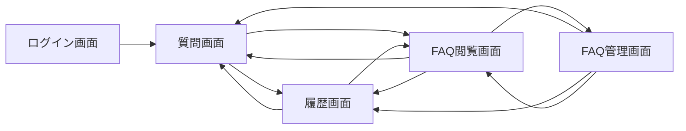
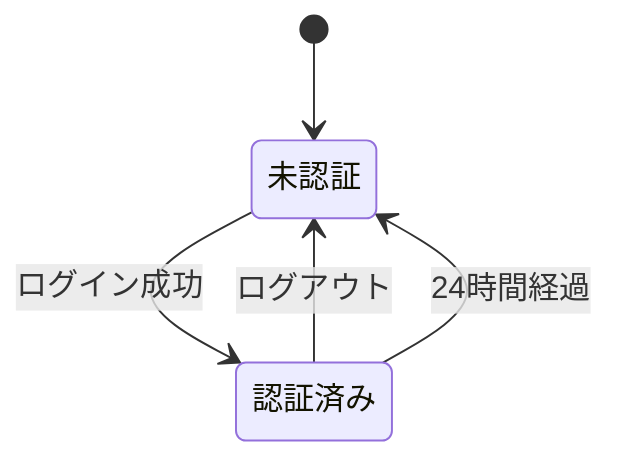
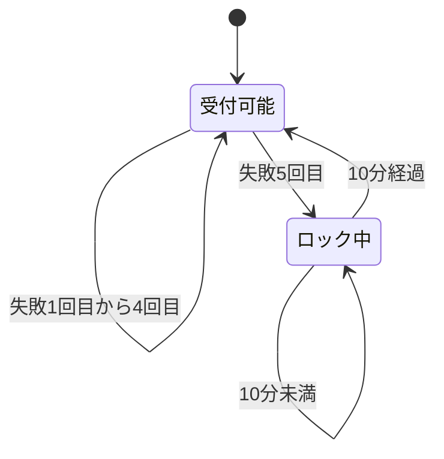
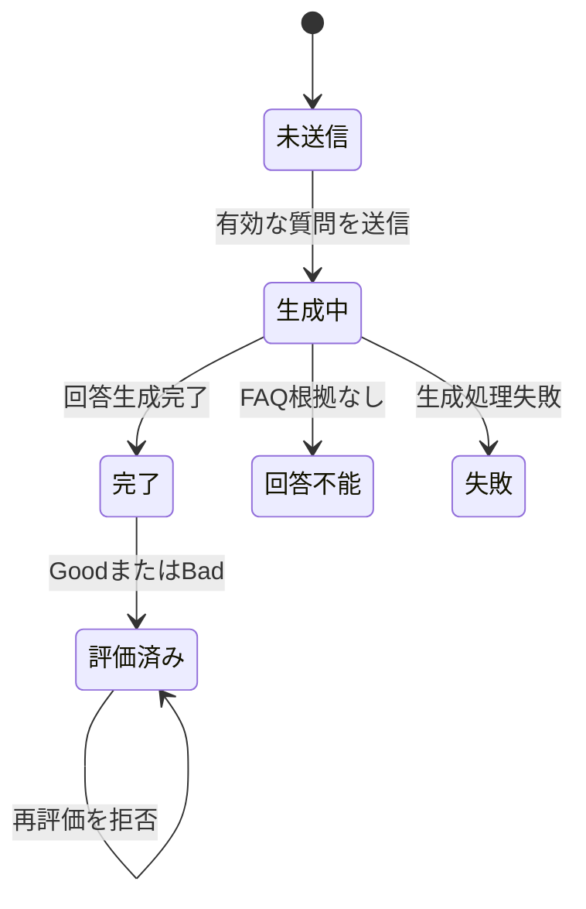

# 画面・振る舞い設計書

## Overview

本書は「社内なんでも質問AI」の画面上の振る舞い、利用者による入力、システムからの出力、および境界値を定義する。技術方式、内部構造、API、データモデル、ファイル構造は本書の対象外とし、プロジェクト共通の技術方針は`.kiro/steering/`を参照する。

対象利用者は一般社員と管理者社員である。両者は質問、本人の履歴、FAQ閲覧を利用でき、管理者社員だけがFAQを登録・修正できる。

## Design Boundary

### 本書で定義するもの
- 5画面の表示内容と利用可能な役割
- 利用者の入力項目、操作、入力制約
- 正常、異常、空状態、処理中の表示
- 文字数、回数、時間の境界値
- 画面遷移と操作可能になる条件
- 要件と画面振る舞いの対応

### 本書で定義しないもの
- フレームワーク、ライブラリ、認証・AI・DBの実現方式
- 内部コンポーネント、API、データモデル、ファイル構造
- 配備、監視、性能チューニング、実装タスク分割
- 対象外機能の将来設計

### 共通方針
- 未認証利用者には社内情報を表示しない。
- 一般社員には管理者専用の導線と操作を表示しない。
- 送信後に入力エラーとなった場合は入力内容を保持し、修正対象と理由を表示する。空入力は送信操作を無効にし、エラーを表示しない。
- 処理中は同一操作の連続実行を防ぐ。
- システムエラーでは内部情報を表示せず、利用者が次に取れる行動を示す。

## Screen Map

| 画面 | 未認証 | 一般社員 | 管理者社員 | 主目的 |
|------|--------|----------|------------|--------|
| ログイン画面 | 利用可 | 質問画面へ移動 | 質問画面へ移動 | 認証 |
| 質問画面 | ログイン画面へ移動 | 利用可 | 利用可 | AIへの質問 |
| 履歴画面 | ログイン画面へ移動 | 本人分のみ | 本人分のみ | 過去の質問確認 |
| FAQ閲覧画面 | ログイン画面へ移動 | 利用可 | 利用可 | FAQの直接閲覧 |
| FAQ管理画面 | ログイン画面へ移動 | アクセス拒否 | 利用可 | FAQ登録・修正 |

管理者社員はFAQ閲覧画面の新規登録・編集ボタンからFAQ管理画面へ移動する。共通ナビゲーションにはFAQ管理を表示しない。ログアウトは全認証済み画面から実行できる。

## Common Authenticated Navigation

### 一般社員
- 質問
- 履歴
- FAQ閲覧
- ログアウト

### 管理者社員
- 質問
- 履歴
- FAQ閲覧
- ログアウト

### 共通の振る舞い
| 状態・操作 | 出力・遷移 |
|------------|------------|
| 認証済みでナビゲーションを選択 | 対象画面を表示する |
| 未認証またはセッション期限切れ | 社内情報を表示せずログイン画面を表示する |
| ログアウトを選択 | セッションを終了しログイン画面を表示する |
| 一般社員がFAQ管理画面へ直接アクセス | 画面を表示せず「権限がありません」と表示する |

## 1. ログイン画面

### Purpose
社員IDとパスワードで利用者を認証し、認証済み画面へ移動させる。

### Inputs
| 項目 | 種別 | 必須 | 入力条件 |
|------|------|------|----------|
| 社員ID | テキスト | 必須 | モックアカウントの社員IDを受け付ける |
| パスワード | パスワード | 必須 | 入力値を画面上で伏せる |

### Actions
| 操作 | 実行可能条件 | 処理中の振る舞い |
|------|--------------|------------------|
| ログイン | 社員IDとパスワードを送信 | 重複送信を受け付けない |

### Outputs and Transitions
| 条件 | 表示・遷移 |
|------|------------|
| 社員IDとパスワードが有効 | 質問画面を表示する |
| 社員IDまたはパスワードが無効 | 「社員IDまたはパスワードが正しくありません」と表示し、ログイン画面に留まる |
| 5回目の連続失敗 | 「ログインに5回失敗したため、10分間ロックされました」と表示する |
| ロック中 | 正しいパスワードでもログインを拒否し、ロック中であることを表示する |
| ロック開始から10分経過 | ログインを再び受け付ける |
| 認証済み利用者がアクセス | 質問画面を表示する |

### Boundary Values
| 対象 | 境界 | 期待結果 |
|------|------|----------|
| 連続失敗回数 | 1〜4回 | 失敗を表示し、ロックしない |
| 連続失敗回数 | 5回目 | 10分間ロックし、連続失敗回数をリセットする |
| ロック時間 | 10分未満 | ログインを拒否する |
| ロック時間 | 10分ちょうど以上 | ログインを受け付け、次の失敗を1回目とする |
| セッション時間 | 24時間未満 | 認証済み状態を維持する |
| セッション時間 | 24時間ちょうど以上 | セッションを終了し、次に認証が必要な時点でログイン画面を表示する |
| ロック中の正しい資格情報 | 任意 | ログインを拒否する |
| ロック解除後の成功 | 任意 | 連続失敗回数をリセットして質問画面を表示する |

## 2. 質問画面

### Purpose
社内制度に関する質問を入力し、登録済みFAQを根拠とする回答を確認・評価する。

### Display
- 質問入力欄
- 現在の入力文字数と上限400文字
- 質問送信操作
- 回答表示領域
- 回答生成中の状態表示
- 回答完了後の出典（ソース）表示
- 回答完了後のGood・Bad評価操作

### Inputs
| 項目 | 種別 | 必須 | 入力条件 |
|------|------|------|----------|
| 質問 | 複数行テキスト | 必須 | 1文字以上400文字以内。日本語、英数字、記号、絵文字、改行、その他のUnicode文字を入力可能 |

文字数は利用者が知覚するUnicode書記素単位で判定し、結合文字や複合絵文字は表示上の1文字として数え、改行も1文字として数える。空白または改行だけの入力は空入力として扱う。入力欄は最大400文字とし、400文字に達した後の追加入力、貼り付け、変換確定による401文字目以降を反映しない。

### Actions and States
| 状態 | 質問送信 | Good・Bad | 表示 |
|------|----------|-----------|------|
| 初期・空入力 | 不可 | 非表示 | 質問入力欄を表示し、送信操作を無効にする |
| 1〜400文字入力済み | 可能 | 非表示 | 質問入力欄と現在文字数を表示 |
| 回答生成中 | 再送信不可 | 無効または非表示 | 生成された回答を順次追加表示 |
| 回答完了 | 次の質問を送信可能 | 未評価の場合に可能 | 完成した回答全体を表示 |
| 評価済み | 次の質問を送信可能 | 再評価不可 | 選択済み評価と受付完了を表示 |
| 生成失敗 | 再試行可能 | 非表示 | エラーと再試行案内を表示 |

### Outputs
| 条件 | 表示 |
|------|------|
| 有効な質問を送信 | 回答生成中であることを表示し、回答を順次表示する |
| 回答生成完了 | 完成した回答全体、その根拠として使用したFAQの出典、Good・Bad操作を表示する |
| 複数のFAQを根拠として使用 | 使用したすべてのFAQを出典として重複なく表示する |
| FAQから回答できない | 「登録済みFAQから回答できません。総務へお問い合わせください」と表示し、出典は表示しない |
| 回答生成に失敗 | ストリーミングを終了し、「回答を取得できませんでした。もう一度お試しください」と表示する |
| 空入力・空白のみ・改行のみ | 送信操作を無効にし、入力エラーは表示しない |
| 400文字到達後の追加入力 | 401文字目以降を入力欄へ反映せず、400文字の内容を保持する |
| 画面制御を経由せず400文字を超える質問が送信された | 受け付けず「質問は400文字以内で入力してください」と表示する |
| APIが入力不正を返す | HTTP 400として管理し、該当する入力エラーを表示する |
| APIが未認証を返す | HTTP 401として管理し、ログイン画面を表示する |
| APIまたは外部サービスで障害が発生 | HTTP 5xxとして管理し、「回答を取得できませんでした。もう一度お試しください」と表示する |
| GoodまたはBad受付成功 | 選択した評価と「評価を受け付けました」を表示する |
| 評価済み回答への再評価 | 評価を変更せず「この回答は評価済みです」と表示する |

### Boundary Values
| 質問文字数 | 送信 | 期待結果 |
|------------|------|----------|
| 0文字 | 不可 | 送信操作を無効にし、エラーは表示しない |
| 空白・改行のみ | 不可 | 送信操作を無効にし、エラーは表示しない |
| 1文字 | 可 | 回答生成を開始 |
| 400文字 | 可 | 回答生成を開始 |
| 401文字目以降の入力 | 反映しない | 400文字の入力内容を保持する |

### Answer Source Display
- 出典は回答本文の後に「出典」として表示する。
- 出典には根拠として使用したFAQの質問を表示する。
- 根拠として使用していないFAQは表示しない。
- 同じFAQを複数箇所で使用しても、出典一覧には1件だけ表示する。
- 回答生成中は出典を表示せず、回答生成完了時に確定した出典を表示する。
- 回答不能または回答生成失敗の場合は出典を表示しない。

### Answer and Feedback Rules
- 回答は登録済みFAQに含まれる情報だけで構成する。
- FAQにない情報を社内情報として推測表示しない。
- Good・Badは回答生成完了前に操作できない。
- 一つの回答に対し、その質問を行った社員が一度だけ評価できる。
- 評価の変更、取消、追加送信はできない。
- 評価の集計・分析結果は表示しない。

## 3. 履歴画面

### Purpose
認証済み社員が、自分の過去の質問と回答を新しい順に確認する。

### Display
各履歴に次の項目を表示する。
- 質問日時
- 質問内容
- AI回答または回答不能の案内
- 送信済みの場合はGoodまたはBad

### States and Outputs
| 条件 | 表示 |
|------|------|
| 本人の履歴が1件以上 | 質問日時が新しい順に履歴を表示する |
| 本人の履歴が0件 | 「質問履歴はありません」と表示する |
| 回答生成が完了 | 質問、回答、質問日時を履歴へ追加する |
| FAQから回答不能と確定 | 質問、回答不能の案内、質問日時を履歴へ追加する |
| 回答生成失敗または回答表示前の中断 | 履歴へ追加しない |
| 他社員の履歴 | 一般社員・管理者社員のいずれにも表示しない |

### Privacy Boundary
- 管理者社員であっても他社員の履歴を閲覧できない。
- 画面操作や直接アクセスによって他社員の履歴を指定できない。

## 4. FAQ閲覧画面

### Purpose
一般社員と管理者社員が、登録済みFAQを直接確認する。

### Display
| 項目 | 内容 |
|------|------|
| FAQ質問 | 登録済みの質問全文 |
| FAQ回答 | 対応する回答全文 |
| 新規登録ボタン | 管理者社員にのみ表示 |
| 編集ボタン | 管理者社員にのみ各FAQごとに表示 |

### States and Outputs
| 条件 | 表示 |
|------|------|
| FAQが1件以上 | 各FAQの質問と回答を表示する |
| FAQが0件 | 「登録済みFAQはありません」と表示する |
| 一般社員が閲覧 | FAQだけを表示し、新規登録・編集ボタンは表示しない |
| 管理者社員が閲覧 | FAQ、新規登録ボタン、各FAQの編集ボタンを表示する |
| 管理者社員が新規登録ボタンを選択 | FAQ管理画面を新規登録モードで表示する |
| 管理者社員がFAQの編集ボタンを選択 | FAQ管理画面を対象FAQの編集モードで表示する |

### Operation Boundary
- FAQの入力と保存は、遷移先のFAQ管理画面で行う。
- この画面内ではFAQ内容を直接編集しない。
- FAQ削除操作は表示しない。

## 5. FAQ管理画面

### Purpose
管理者社員が、AI回答の根拠となるFAQを新規登録または編集する。

### Modes
| モード | 開始方法 | 初期表示 |
|--------|----------|----------|
| 新規登録 | FAQ閲覧画面の新規登録ボタン | 質問・回答が空の入力欄と、無効な登録ボタン |
| 編集 | FAQ閲覧画面の対象FAQの編集ボタン | 対象FAQの質問・回答が入力済みの入力欄と、有効な保存ボタン |

### Access
| 利用者 | 結果 |
|--------|------|
| 管理者社員 | 指定された新規登録モードまたは編集モードを表示する |
| 一般社員 | 画面を表示せず「権限がありません」と表示する |
| 未認証利用者 | ログイン画面を表示する |

### Inputs
| 項目 | 種別 | 必須 | 入力条件 |
|------|------|------|----------|
| FAQ質問 | 複数行テキスト | 必須 | 1文字以上1000文字以内。日本語、英数字、記号、絵文字、改行、その他のUnicode文字を入力可能 |
| FAQ回答 | 複数行テキスト | 必須 | 1文字以上1000文字以内。日本語、英数字、記号、絵文字、改行、その他のUnicode文字を入力可能 |

文字数は利用者が知覚するUnicode書記素単位で判定し、結合文字や複合絵文字は表示上の1文字として数え、改行も1文字として数える。空白または改行だけの入力は空入力として扱う。各入力欄は最大1000文字とし、1000文字に達した後の追加入力、貼り付け、変換確定による1001文字目以降を反映しない。重複判定は、入力された質問文字列が既存FAQの質問文字列と完全一致するかで行う。

### Actions and States
| モード・状態 | ボタン | 操作可否 | 正常時出力 |
|--------------|--------|----------|------------|
| 新規登録・質問または回答が空 | 登録 | 無効 | なし |
| 新規登録・質問と回答が入力済み | 登録 | 有効 | FAQを追加し「FAQを登録しました」と表示する |
| 編集・質問または回答が空 | 保存 | 無効 | なし |
| 編集・質問と回答が入力済み | 保存 | 有効 | FAQを更新し「FAQを修正しました」と表示する |
| 編集・初期表示から変更なし | 保存 | 有効 | 空更新を受け付け「FAQを修正しました」と表示する |

### Validation and Conflict Outputs
| 条件 | 結果 |
|------|------|
| 質問または回答が空 | 必須エラーは表示せず、登録または保存ボタンを無効にする |
| 質問または回答が1000文字に到達後の追加入力 | 1001文字目以降を反映せず、1000文字の内容を保持する |
| 画面制御を経由せず1000文字を超える値が送信された | 変更を反映しない |
| 登録質問が既存FAQと完全一致 | 登録せず「同じ質問が登録済みです」と表示する |
| 修正質問が修正対象以外と完全一致 | 更新せず「同じ質問が登録済みです」と表示する |
| 修正対象自身と質問が同一 | 他の変更の有無にかかわらず保存できる |
| 一般社員による登録・修正操作 | 変更せず「権限がありません」と表示する |

### Boundary Values
| 対象 | 0文字・空白・改行のみ | 1文字 | 1000文字 | 1001文字目以降 |
|------|----------------------|-------|----------|----------------|
| FAQ質問 | 入力可・ボタン無効 | 入力可 | 入力可 | 反映しない |
| FAQ回答 | 入力可・ボタン無効 | 入力可 | 入力可 | 反映しない |

### Operation Boundary
- FAQ削除操作を表示しない。
- FAQ削除要求を受け付けない。

## Cross-Screen State Rules

### Session Lifecycle

### Login Lock Lifecycle

### Answer Lifecycle

## Requirements Traceability

| Requirement | Design Coverage |
|-------------|-----------------|
| 1.1, 1.2, 1.3 | ログイン画面の入力と正常・異常出力 |
| 1.4, 1.5, 1.6, 1.7 | ログイン失敗回数と10分ロックの境界値 |
| 1.8, 1.9, 1.10, 1.11, 1.12 | セッション境界、リダイレクト、ログアウト |
| 1.13 | モックアカウント入力 |
| 2.1, 2.5, 2.6 | 質問の0・1・400・401文字境界 |
| 2.2, 2.3, 2.4 | FAQ根拠回答、順次・完成表示、完成後の出典表示 |
| 2.7, 2.8, 2.9 | 回答不能、生成失敗、推測禁止 |
| 3.1, 3.2, 3.3, 3.4, 3.5 | 履歴表示、空状態、本人限定、追加条件 |
| 4.1, 4.2, 4.3, 4.4 | FAQ閲覧の表示、空状態、ロール別の新規登録・編集ボタン |
| 5.1, 5.2, 5.3, 5.4 | FAQ管理の新規登録・編集モード、Unicode入力、登録、空更新を含む保存 |
| 5.5, 5.6, 5.7, 5.8 | 空入力時のボタン無効、1000文字入力制御、重複時の出力 |
| 5.9, 5.10 | 管理者限定と削除操作なし |
| 6.1, 6.2, 6.3, 6.4, 6.5, 6.6 | 評価の表示条件、一回制約、集計非表示 |
| 7.1, 7.2, 7.3, 7.4, 7.5 | 5画面、ロール別移動、未認証制御、対象外機能 |

## Deferred to Later Phases

次の事項は画面設計を変更せずに後工程で決定する。
- 画面コンポーネントの分割
- APIおよび内部インターフェース
- データの物理構造
- ファイル・ディレクトリ構造
- 使用ライブラリの具体的バージョン
- 配備、監視、性能試験の詳細

後工程の技術判断は`.kiro/steering/tech.md`および`.kiro/steering/structure.md`に従う。画面の入力、出力、境界値を変更する場合は本設計と要件の再確認を行う。
